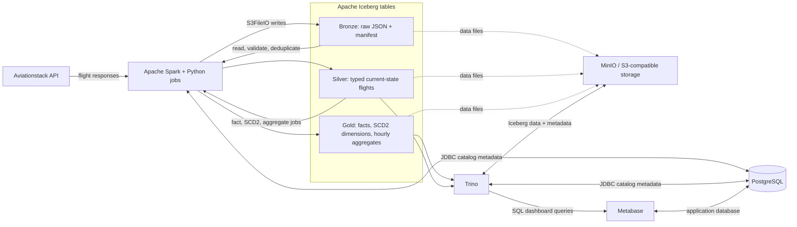
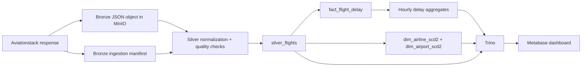
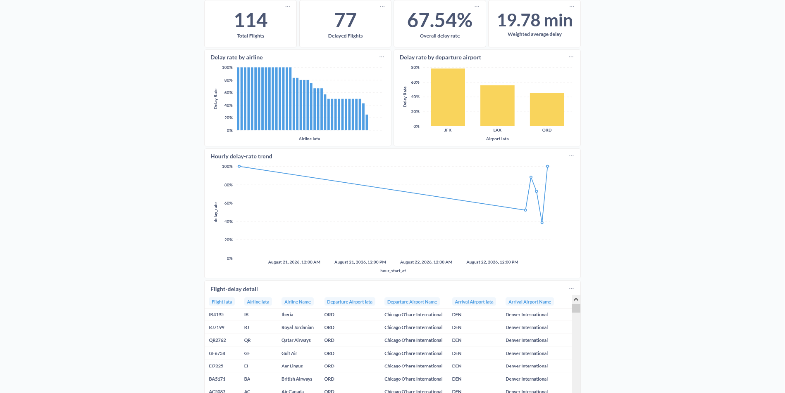

# Flight Delay Lakehouse

> A local, end-to-end data lakehouse that ingests flight-status data, applies the medallion architecture, and serves delay analytics to Metabase.

## Project status

**Implemented through the Gold layer.** The local stack, Bronze ingestion, Silver transformation, Iceberg schema evolution/time travel, Gold aggregates, and SCD Type 2 dimensions are runnable. The Metabase dashboard is connected to Trino and documents the Gold-layer metrics.

## Why this project?

This project is designed to demonstrate practical data-engineering skills that are common in lakehouse roles:

- Medallion data modelling: Bronze, Silver, and Gold layers.
- Apache Iceberg tables on object storage, including ACID transactions and time travel.
- Schema evolution without breaking ingestion.
- Late-arriving data processing and idempotent reruns.
- Slowly changing dimensions (SCD Type 2).
- Analytics consumption through Trino and Metabase.

## Business question

> Which airlines, airports, and hours of the day have the highest flight-delay rates?

For this project, a delayed flight is one with `delay_minutes > 15`. The source fields and calculation will be recorded in the data contract before ingestion is built.

## Architecture and dependencies



### Technology choices

| Area | Choice | Reason |
|---|---|---|
| Flight data | Aviationstack API | Supplies flight-status data usable for delay analysis. |
| Object storage | MinIO | Local, S3-compatible, and free. |
| Table format | Apache Iceberg | Provides schema evolution, snapshots, and time travel. |
| Compute | Apache Spark (PySpark) | Industry-standard distributed data processing. |
| SQL serving | Trino | Queries Iceberg data and connects cleanly to BI. |
| BI | Metabase | Visualizes Gold-layer metrics. |
| Local environment | Docker Compose | Reproducible setup with no cloud cost. |

OpenSky is intentionally not the primary source because it provides aircraft-tracking data but does not provide commercial schedule or delay data.

## Scope

### Included

- Low-frequency Aviationstack ingestion, retaining every API response as immutable JSON.
- A small, focused airport/airline scope suitable for the API's free request allowance.
- Reproducible local data fixtures for development and demonstrations.
- A Bronze-to-Silver-to-Gold batch pipeline.
- A Metabase dashboard backed by Gold tables through Trino.

### Explicitly deferred

- Cloud deployment and paid cloud services.
- Streaming and Kafka.
- Kubernetes.
- Airflow orchestration, until the command-line pipeline is complete and idempotent.

## Data layers

| Layer | Storage | Purpose | Main output |
|---|---|---|---|
| Bronze | JSON objects in MinIO and an Iceberg ingestion manifest | Preserve the source exactly as received; append only. | Raw API response, source URL, ingestion timestamp, file path, payload hash. |
| Silver | Iceberg | Parse, cast, validate, deduplicate, and reconcile late updates. | One current record per flight instance, with audit columns. |
| Gold | Iceberg | Aggregate and model data for analytics. | Hourly airport and airline delay metrics; SCD Type 2 dimensions. |

### Core data model

The Silver pipeline will create a stable `flight_instance_key` from the flight number, departure airport, and scheduled departure timestamp. It will retain `source_file`, `observed_at`, and `payload_sha256` for traceability.

Gold will include:

- `fact_flight_delay` — flight-level delay facts.
- `dim_airport_scd2` — airport history with `effective_from`, `effective_to`, and `is_current`.
- `dim_airline_scd2` — airline history with the same SCD Type 2 fields.
- `agg_delay_by_airport_hour` — total flights, delayed flights, and delay rate.
- `agg_delay_by_airline_hour` — total flights, delayed flights, and delay rate.

### Data lineage



## Build plan

Work is deliberately ordered so that the data pipeline works before additional platform complexity is introduced.

### Milestone 0 — define the contract

- [ ] Register for Aviationstack and store the API key only in a local `.env` file.
- [x] Add `.env.example` with the required variable names but no secrets.
- [ ] Choose a small initial set of airports or airlines.
- [x] Capture representative API responses as sanitized fixtures.
- [x] Create `docs/data-contract.md` describing fields, data types, business keys, and quality rules.
- [x] Create architecture and decision records in `docs/`.

**Done when:** the source payload, delay calculation, table schemas, and acceptance criteria are written down.

### Milestone 1 — local platform

- [x] Create `docker-compose.yml`.
- [x] Start MinIO, PostgreSQL, Spark, Trino, and Metabase locally.
- [x] Configure Spark and Trino to use an Iceberg catalog with MinIO as object storage.
- [x] Add a `Makefile` or equivalent task runner for `up`, `down`, and `test`.
- [x] Confirm a sample Iceberg table can be created and queried through Trino.

**Done when:** a new developer can start the full local stack with one documented command and query a sample Iceberg table.

### Milestone 2 — Bronze ingestion

- [x] Implement a Python API client with timeouts, retries, structured logging, and API-key configuration.
- [x] Write each response as a uniquely named JSON object in MinIO, partitioned by ingestion date and endpoint.
- [x] Append a manifest record containing request parameters, object path, ingestion time, HTTP status, and payload hash.
- [x] Make the command safe to rerun without overwriting raw data.
- [x] Add fixture-based tests that do not call the API.

**Done when:** the raw source response can be traced from its manifest record to a MinIO object.

### Milestone 3 — Silver transformation

- [x] Parse Bronze JSON into a typed Iceberg `silver_flights` table.
- [x] Standardize timestamps in UTC and cast numeric fields.
- [x] Flag invalid records instead of silently discarding them.
- [x] Deduplicate by `flight_instance_key`, retaining the newest valid source update.
- [x] Reprocess a rolling 48-hour lookback window to capture late-arriving data.
- [x] Prove idempotency: running the job twice produces the same Silver result.

**Done when:** Silver contains clean, traceable, deduplicated data and automated tests cover duplicate and late records.

### Milestone 4 — lakehouse capabilities

- [x] Add a version-two fixture with a new additive field, such as `aircraft_type`.
- [x] Evolve the Iceberg table schema and backfill or default the new field safely.
- [x] Add a late correction fixture for an existing flight instance.
- [x] Record the Iceberg snapshot before the correction.
- [x] Query the table both before and after that snapshot, saving the commands and outputs in documentation.

**Done when:** the repository demonstrates schema evolution and time travel with repeatable scripts or tests, not just prose.

### Milestone 5 — Gold modelling

- [x] Build `fact_flight_delay` and hourly aggregate tables.
- [x] Implement SCD Type 2 merges for airport and airline dimensions.
- [x] Add data-quality checks: non-null business key, non-negative delays, one current dimension row per natural key, and valid effective-date ranges.
- [x] Validate aggregate counts against Silver data.

**Done when:** Gold answers the business question and preserves dimension history correctly.

### Milestone 6 — analytics and orchestration

- [x] Connect Metabase to Trino.
- [x] Build a dashboard with delay rate by airport, airline, and hour.
- [ ] Add dashboard filters and clear metric definitions.
- [x] Add screenshots and a short walkthrough to this README.
- [ ] Wrap the tested commands in an Airflow DAG as an optional final enhancement.

**Done when:** a viewer can run the stack, open the dashboard, and understand the data lineage.

### Milestone 7 — portfolio polish

- [x] Add an architecture diagram and a data-lineage diagram.
- [x] Add setup, run, test, and teardown commands.
- [x] Add an end-to-end demo script.
- [x] Run the demo from a clean checkout.
- [x] Add a brief section explaining trade-offs and future improvements.
- [x] Add concise CV-ready project bullets.

**Done when:** the repository is understandable and demonstrable without an oral explanation.

## Advanced demonstrations

The API may not naturally change schema or deliver a convenient late correction during the project window. These scenarios will therefore use versioned fixtures that mimic real operational behaviour; the production code path remains identical.

| Capability | Demonstration |
|---|---|
| Schema evolution | Ingest v1 payloads, then ingest v2 payloads containing a new field. Add the Iceberg column without breaking historical records. |
| Time travel | Query `silver_flights` at a saved Iceberg snapshot before a late correction, then compare it with the current snapshot. |
| Late data | Re-ingest a flight instance with a newer `source_updated_at` and prove that Silver selects the corrected record. |
| SCD Type 2 | Change an airport or airline attribute in a fixture and prove the prior row is closed while a new current row is created. |
| Idempotency | Run each pipeline step twice and assert that row counts and current-state results remain unchanged. |

## Repository layout

```text
.
├── docker-compose.yml
├── .env.example
├── Makefile
├── data/fixtures/aviationstack/       # Sanitized fixture payloads
├── docs/
│   ├── adr/                           # Architecture decision record
│   ├── demo-runbook.md
│   └── images/                        # Dashboard evidence
├── jobs/
│   ├── ingest_bronze.py
│   ├── bronze_to_silver.py
│   └── silver_to_gold.py
├── scripts/
│   ├── lakehouse.ps1                  # Task runner
│   └── demo.ps1                       # End-to-end fixture demo
├── sql/metabase/                      # Dashboard card queries
├── src/flight_lakehouse/              # Bronze and Silver domain logic
└── tests/                             # Offline contract and unit tests
```

## Setup, run, test, and teardown (PowerShell)

Create local configuration and start the stack. Fixture runs do not require an Aviationstack key; add one only for live ingestion.

```powershell
.\scripts\lakehouse.ps1 configure
# Edit .env to choose local passwords and optionally add AVIATIONSTACK_API_KEY.
.\scripts\lakehouse.ps1 up
.\scripts\lakehouse.ps1 platform-check
```

Run the deterministic fixture pipeline:

```powershell
.\scripts\lakehouse.ps1 bronze-fixture
.\scripts\lakehouse.ps1 silver
.\scripts\lakehouse.ps1 gold
.\scripts\lakehouse.ps1 test
```

Run the full end-to-end fixture demonstration, including schema evolution, time travel, a late correction, and SCD Type 2 changes:

```powershell
.\scripts\demo.ps1
```

For a disposable clean-checkout validation, use `-StopAfterDemo`. After an existing local stack is stopped to free the host ports, the script assigns a unique Compose project name, so its containers and data volumes are separate from the regular lakehouse environment.

```powershell
.\scripts\demo.ps1 -StopAfterDemo
```

Stop containers while preserving the local data volumes:

```powershell
.\scripts\lakehouse.ps1 down
```

To remove all local containers **and data volumes**, use `docker compose down -v`. This is destructive and cannot be undone.

For the schema-evolution, time-travel, and SCD Type 2 walkthrough, see [docs/demo-runbook.md](docs/demo-runbook.md). Useful local URLs: MinIO Console at `http://localhost:9001`, Trino at `http://localhost:8080`, and Metabase at `http://localhost:3000`.

## Metabase dashboard

The **Flight Delay Analytics** dashboard queries the Gold Iceberg aggregates through Trino. It contains total and delayed flight KPIs, overall delay rate, weighted average delay, comparisons by airline and departure airport, an hourly trend, and a Silver-level flight detail table.

The dashboard shown below was refreshed from a live sample containing 114 delay facts, 63 airlines, three departure airports, and nine departure hours.



The native SQL for every dashboard card is in [sql/metabase/README.md](sql/metabase/README.md).

## Quality and security rules

- Never commit API keys, `.env`, MinIO credentials, or real production payloads containing sensitive values.
- Keep Bronze immutable; corrections are new objects, never overwritten source files.
- Use fixtures for tests so routine development does not consume API requests.
- Log request metadata and failures without logging secrets.
- Keep all timestamps in UTC in Bronze, Silver, and Gold.

## Evidence to collect

The final repository should contain or link to:

- A local architecture diagram.
- A successful end-to-end run from clean setup to Metabase dashboard.
- Automated test results.
- A schema-evolution run and its resulting table schema.
- A time-travel query showing a table before and after a late update.
- [x] Dashboard screenshot and metric definitions in the SQL bundle.

## Trade-offs and future improvements

- **Batch first:** Spark batch jobs make the data flow repeatable and easy to demonstrate locally. Airflow is deliberately deferred until scheduling adds more value than complexity.
- **Current-state Silver:** Silver keeps the latest valid flight observation for analytics while Bronze and Iceberg snapshots retain raw and historical evidence. A future extension could add a separate event-history table for every status change.
- **Local-first infrastructure:** MinIO and Docker Compose keep cost and setup friction low. A production deployment would use managed object storage, secrets management, monitoring, alerting, and least-privilege service credentials.
- **API limits:** Live Aviationstack calls are intentionally low frequency. Versioned fixtures make testing deterministic without consuming API quota.
- **Next steps:** Add dashboard date/airline/airport filters, schedule the pipeline, introduce data freshness checks, and deploy the same Iceberg design to cloud object storage.

## CV-ready project bullets

- Built a containerized flight-delay lakehouse with Python, Apache Spark, Apache Iceberg, MinIO, PostgreSQL, Trino, and Metabase using a Bronze → Silver → Gold medallion architecture.
- Implemented append-only raw ingestion, typed and idempotent Silver merges, late-arriving flight corrections, additive Iceberg schema evolution, time travel, and SCD Type 2 airport and airline dimensions.
- Delivered Gold-layer hourly delay metrics and a Metabase dashboard; validated the pipeline with deterministic fixtures and a live sample covering 63 airlines, three departure airports, and nine departure hours.
