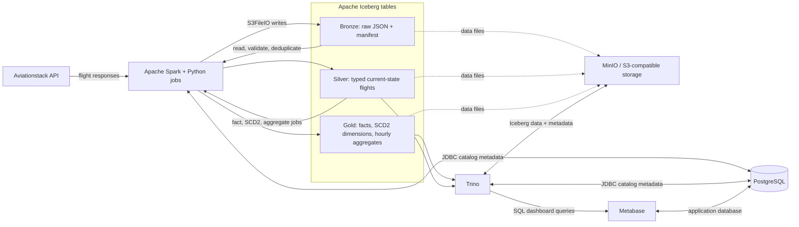
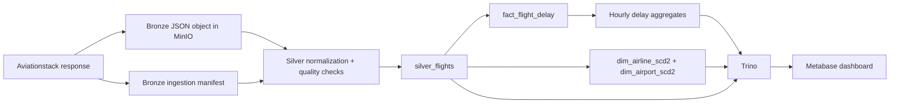

# Flight Delay Lakehouse

> A local, end-to-end data lakehouse that ingests flight-status data, applies the medallion architecture, and serves delay analytics to Metabase.

## Project status

**Implemented through the Gold layer.** The local stack, Bronze ingestion, Silver transformation, Iceberg schema evolution/time travel, Gold aggregates, and SCD Type 2 dimensions are runnable. The Metabase dashboard is connected to Trino and documents the Gold-layer metrics.

## Project goals

The project answers a practical analytics question from flight-status data while keeping the full data lifecycle reproducible on a local machine:

- Preserve each source response as an immutable Bronze record.
- Produce a typed, deduplicated Silver view that handles late corrections.
- Use Iceberg snapshots for schema evolution and time-travel queries.
- Model Gold facts, hourly aggregates, and historical airport and airline dimensions.
- Serve the curated data through Trino and a Metabase dashboard.

## Business question

> Which airlines, airports, and hours of the day have the highest flight-delay rates?

For this project, a delayed flight is one with `delay_minutes > 15`. The source fields, quality rules, and calculation are documented in [docs/data-contract.md](docs/data-contract.md).

## Architecture and dependencies



### Technology choices

| Area | Choice | Reason |
|---|---|---|
| Flight data | Aviationstack API | Supplies flight-status data usable for delay analysis. |
| Object storage | MinIO | Local, S3-compatible, and free. |
| Table format | Apache Iceberg | Provides schema evolution, snapshots, and time travel. |
| Compute | Apache Spark (PySpark) | Industry-standard distributed data processing. |
| SQL serving | Trino | Queries Iceberg data and connects cleanly to BI. |
| BI | Metabase | Visualizes Gold-layer metrics. |
| Local environment | Docker Compose | Reproducible setup with no cloud cost. |

OpenSky is intentionally not the primary source because it provides aircraft-tracking data but does not provide commercial schedule or delay data.

## Scope

### Included

- Low-frequency Aviationstack ingestion, retaining every API response as immutable JSON.
- A small, focused airport/airline scope suitable for the API's free request allowance.
- Reproducible local data fixtures for development and demonstrations.
- A Bronze-to-Silver-to-Gold batch pipeline.
- A Metabase dashboard backed by Gold tables through Trino.

### Explicitly deferred

- Cloud deployment and paid cloud services.
- Streaming and Kafka.
- Kubernetes.
- Airflow orchestration, until the command-line pipeline is complete and idempotent.

## Data layers

| Layer | Storage | Purpose | Main output |
|---|---|---|---|
| Bronze | JSON objects in MinIO and an Iceberg ingestion manifest | Preserve the source exactly as received; append only. | Raw API response, source URL, ingestion timestamp, file path, payload hash. |
| Silver | Iceberg | Parse, cast, validate, deduplicate, and reconcile late updates. | One current record per flight instance, with audit columns. |
| Gold | Iceberg | Aggregate and model data for analytics. | Hourly airport and airline delay metrics; SCD Type 2 dimensions. |

### Core data model

The Silver pipeline will create a stable `flight_instance_key` from the flight number, departure airport, and scheduled departure timestamp. It will retain `source_file`, `observed_at`, and `payload_sha256` for traceability.

Gold will include:

- `fact_flight_delay` — flight-level delay facts.
- `dim_airport_scd2` — airport history with `effective_from`, `effective_to`, and `is_current`.
- `dim_airline_scd2` — airline history with the same SCD Type 2 fields.
- `agg_delay_by_airport_hour` — total flights, delayed flights, and delay rate.
- `agg_delay_by_airline_hour` — total flights, delayed flights, and delay rate.

### Data lineage



## Implementation status

| Area | Status | What is implemented |
|---|---|---|
| Local platform | Complete | Docker Compose runs MinIO, PostgreSQL, Spark, Trino, and Metabase. |
| Bronze | Complete | The ingestion client stores immutable Aviationstack JSON objects and an append-only manifest. |
| Silver | Complete | Typed normalization, validation, deduplication, late-arriving corrections, and idempotent reruns. |
| Iceberg capabilities | Complete | Additive schema evolution, snapshots, and repeatable time-travel queries. |
| Gold | Complete | Flight-delay facts, hourly airport and airline aggregates, and SCD Type 2 airport and airline dimensions. |
| Analytics | Complete | Metabase dashboard queries Gold tables through Trino. |
| Scheduling | Deferred | Airflow remains an optional enhancement after the batch workflow. |

## Remaining improvements

- Add dashboard filters for date, departure airport, and airline.
- Add a short metric glossary directly in Metabase.
- Schedule Bronze → Silver → Gold with Airflow or another orchestrator.
- Add freshness checks, monitoring, and alerting for production-style operation.

## Advanced demonstrations

The API may not naturally change schema or deliver a convenient late correction during the project window. These scenarios will therefore use versioned fixtures that mimic real operational behaviour; the production code path remains identical.

| Capability | Demonstration |
|---|---|
| Schema evolution | Ingest v1 payloads, then ingest v2 payloads containing a new field. Add the Iceberg column without breaking historical records. |
| Time travel | Query `silver_flights` at a saved Iceberg snapshot before a late correction, then compare it with the current snapshot. |
| Late data | Re-ingest a flight instance with a newer `source_updated_at` and prove that Silver selects the corrected record. |
| SCD Type 2 | Change an airport or airline attribute in a fixture and prove the prior row is closed while a new current row is created. |
| Idempotency | Run each pipeline step twice and assert that row counts and current-state results remain unchanged. |

## Repository layout

```text
.
├── docker-compose.yml
├── .env.example
├── Makefile
├── data/fixtures/aviationstack/       # Sanitized fixture payloads
├── docs/
│   ├── adr/                           # Architecture decision record
│   ├── demo-runbook.md
│   └── images/                        # Dashboard evidence
├── jobs/
│   ├── ingest_bronze.py
│   ├── bronze_to_silver.py
│   └── silver_to_gold.py
├── scripts/
│   ├── lakehouse.ps1                  # Task runner
│   └── demo.ps1                       # End-to-end fixture demo
├── sql/metabase/                      # Dashboard card queries
├── src/flight_lakehouse/              # Bronze and Silver domain logic
└── tests/                             # Offline contract and unit tests
```

## Setup, run, test, and teardown (PowerShell)

Create local configuration and start the stack. Fixture runs do not require an Aviationstack key; add one only for live ingestion.

```powershell
.\scripts\lakehouse.ps1 configure
# Edit .env to choose local passwords and optionally add AVIATIONSTACK_API_KEY.
.\scripts\lakehouse.ps1 up
.\scripts\lakehouse.ps1 platform-check
```

Run the deterministic fixture pipeline:

```powershell
.\scripts\lakehouse.ps1 bronze-fixture
.\scripts\lakehouse.ps1 silver
.\scripts\lakehouse.ps1 gold
.\scripts\lakehouse.ps1 test
```

Run the full end-to-end fixture demonstration, including schema evolution, time travel, a late correction, and SCD Type 2 changes:

```powershell
.\scripts\demo.ps1
```

For a disposable clean-checkout validation, use `-StopAfterDemo`. After an existing local stack is stopped to free the host ports, the script assigns a unique Compose project name, so its containers and data volumes are separate from the regular lakehouse environment.

```powershell
.\scripts\demo.ps1 -StopAfterDemo
```

Stop containers while preserving the local data volumes:

```powershell
.\scripts\lakehouse.ps1 down
```

To remove all local containers **and data volumes**, use `docker compose down -v`. This is destructive and cannot be undone.

For the schema-evolution, time-travel, and SCD Type 2 walkthrough, see [docs/demo-runbook.md](docs/demo-runbook.md). Useful local URLs: MinIO Console at `http://localhost:9001`, Trino at `http://localhost:8080`, and Metabase at `http://localhost:3000`.

## Metabase dashboard

The **Flight Delay Analytics** dashboard queries the Gold Iceberg aggregates through Trino. It contains total and delayed flight KPIs, overall delay rate, weighted average delay, comparisons by airline and departure airport, an hourly trend, and a Silver-level flight detail table.

The dashboard shown below was refreshed from a live sample containing 114 delay facts, 63 airlines, three departure airports, and nine departure hours.


The native SQL for every dashboard card is in [sql/metabase/README.md](sql/metabase/README.md).

## Quality and security rules

- Never commit API keys, `.env`, MinIO credentials, or real production payloads containing sensitive values.
- Keep Bronze immutable; corrections are new objects, never overwritten source files.
- Use fixtures for tests so routine development does not consume API requests.
- Log request metadata and failures without logging secrets.
- Keep all timestamps in UTC in Bronze, Silver, and Gold.

## Verification evidence

- The fixture-only demo runs the full pipeline from a clean checkout, including schema evolution, time travel, late corrections, and SCD Type 2 changes.
- The offline test suite validates Bronze ingestion, fixtures, and Silver logic without using API quota.
- The Metabase screenshot below shows a live sample queried from Gold through Trino.
- The walkthrough in [docs/demo-runbook.md](docs/demo-runbook.md) records the repeatable Iceberg demonstrations.

## Design trade-offs and next steps

- **Batch first:** Spark batch jobs make the data flow repeatable and easy to demonstrate locally. Airflow is deliberately deferred until scheduling adds more value than complexity.
- **Current-state Silver:** Silver keeps the latest valid flight observation for analytics while Bronze and Iceberg snapshots retain raw and historical evidence. A future extension could add a separate event-history table for every status change.
- **Local-first infrastructure:** MinIO and Docker Compose keep cost and setup friction low. A production deployment would use managed object storage, secrets management, monitoring, alerting, and least-privilege service credentials.
- **API limits:** Live Aviationstack calls are intentionally low frequency. Versioned fixtures make testing deterministic without consuming API quota.
- **Next steps:** Add dashboard date/airline/airport filters, schedule the pipeline, introduce data freshness checks, and deploy the same Iceberg design to cloud object storage.
